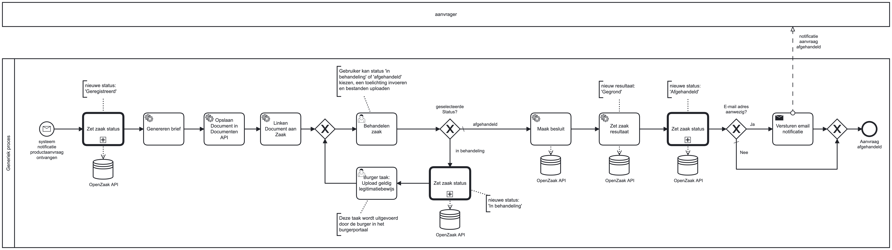
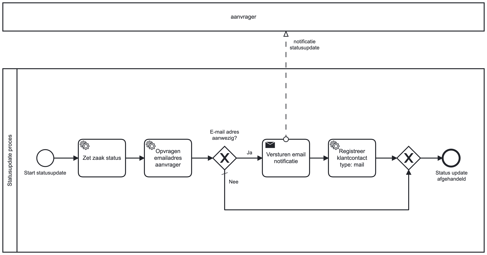

# Generieke zaak
This is a generic process for handling a case (zaak) in municipalities.

It automatically creates a case in OpenZaak when a product has been requested by a resident. It handles the creation of communication, document creation and decision making. The final product is stored and send to the resident.

This blueprint was tested on Valtimo `9.24.0.RELEASE`.

**Included process models:**

  
Generiek proces

  

  
Zet zaak status

  

## Adjusting the BPMN models
Please use the Camunda modeler to make the changes as described below:  
* `resources/bpmn/generiek-proces.bpmn`
  * Change properties on `Versturen email notificatie` task:
    * `mailSendTaskFrom`
    * `mailSendTaskSubject`
    * `mailSendTaskTemplate`
* `resources/bpmn/zaakstatus-update.bpmn`
  * Change properties on `Versturen email notificatie` task:
    * `mailSendTaskFrom`
    * `mailSendTaskSubject`
    * `mailSendTaskTemplate`

## Configuring the case dependencies
The blueprint requires some post-deployment configuration. This is described below.

Documentation about this subject can be found [here](https://docs.valtimo.nl/using-valtimo)
### Connectors
Connectors can be found and configured at Admin -> Connectors.
* **OpenZaak**
  * Enter the service URL, credentials
  * Set the URL to the catalog that should be used.
* **Open Notificaties**
  * Enter the service base URL and credentials 
  * Point the callback URL to the GZAC service
* **Objects API - Taak**
  * Enter the service details for Object- and ObjecTypen API. 
  * Object type name and title should respectively be set to 'taak' and 'Taak'.
  * The Object type URL should point to the 'taak' type in the Object type API.
* **Taak connector**
  * Set 'Open Notificatie Connector' to the earlier created 'Open Notificaties' configuration
  * Set 'Objects API connector' to the earlier created 'Objects API - Taak' configuration
* **Objecten API - Productaanvraag**
  * Enter the service details for Object- and ObjecTypen API.
  * Object type name and title should respectively be set to 'productaanvraag' and 'Productaanvraag'.
  * The Object type URL should point to the 'productaanvraag' type in the Object type API.
* **Productaanvraag**
  * Add a type where:
    * Type of request: bezwaar
    * Case definition: generieke-zaak
    * Process definition: GeneriekProces
  * Connectors
    * Set 'Open Notificatie Connector' to 'Open Notificaties'
    * Set 'Objects API connector' to 'Objecten API - Productaanvraag*'
  * Request
    * Set the role type URL
* **Besluiten**
  * Set the URL to the openzaak-besluiten service
  * Enter the secret and clientID

### Plugins
Documentation about plugins can be found [here](https://docs.valtimo.nl/using-valtimo/plugins)
* [**SmartDocuments**](https://docs.valtimo.nl/using-valtimo/plugins/configure-smartdocuments-plugin#configure-the-plugin)
* [**OpenZaak**](https://docs.valtimo.nl/using-valtimo/plugins/configure-openzaak-plugin#configuring-the-plugin)
* [**Documenten API**](https://docs.valtimo.nl/using-valtimo/plugins/configure-documenten-api-plugin#configure-the-plugin)
* **Catalogi API**
  * Please enter a name, the URL of the Catalogi API and select the OpenZaak configuration created earlier
* [**Zaken API**](https://docs.valtimo.nl/using-valtimo/plugins/configure-zaken-api-plugin#configure-the-plugin)

### Process links (Connectors)
**Generiek proces**
* `Maak besluit` uses the OpenZaak connector with action `Create besluit`.
* `Zet zaak resultaat` uses the OpenZaak connector with action `Set resultaat`.

### Process links (v2, Plugins)
* `Genereren brief` uses [SmartDocuments - Generate document](https://docs.valtimo.nl/using-valtimo/plugins/configure-smartdocuments-plugin#generate-document).
* `Opslaan Document in Documenten API` uses [Documenten API - Save document](https://docs.valtimo.nl/using-valtimo/plugins/configure-documenten-api-plugin#save-document)
* `Linken Document aan Zaak` uses [Zaken API - Link document to zaak](https://docs.valtimo.nl/using-valtimo/plugins/configure-zaken-api-plugin#link-document-to-zaak)

### Forms
* `Behandelen zaak` should already be linked to the `generiek-proces.behandelen-zaak` form at deployment.
* `Burger taak: Upload geldig legitimatiebewijs` This task uses a form provided by TaakConnector: 'upload-legitimatiebewijs-form'

### Other
* Admin -> Cases -> Generieke zaak 
  * **Connected zaak type**
    * Should be set to applicable ZaakType in OpenZaak
    * Automatically create for each case: enabled
  * **Entitlements**
    * Set the roles who should access this case
  * **Link upload process to case**
    * Select the Upload Document process
