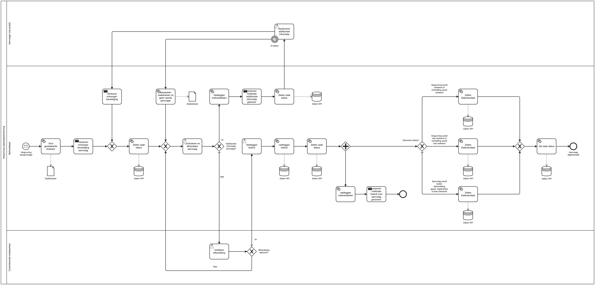

# Basisproces Vergunning opkoopbescherming

## Inleiding
Dit basisproces kan gebruikt worden om een aanvraag voor een verhuurvergunning bij opkoopbescherming te verwerken. 

## Installatie
We gaan uit van een bestaande Valtimo GZAC backend repository. Dit basisproces is getest op Valtimo GZAC 10.7.0.RELEASE.

Kopiëer de bestanden van de `config` directory naar de config directory van Valtimo GZAC (`src/main/resources/config/`)
en behoud dezelfde directory structuur.

Na het opstarten van Valtimo GZAC:
* De volgende rollen toevoegen aan het process `Vergunning Opkoopbescherming`:
  * `ROLE_USER, ROLE_DEVELOPER, ROLE_ADMIN`  
  Dit kan gedaan worden onder `Rechten` in het Dossier configuratie scherm (`Admin` -> `Dossier` -> `Vergunning Opkoopbescherming`)

Na een refresh van de pagina is het `Vergunning Opkoopbescherming` dossier beschikbaar onder Dossiers.

## Uitvoeren proces

Het proces kan gestart worden door het aanmaken van een nieuw dossier en vervolgens een aanvraagformulier in te vullen. Na het indienen kan een behandelaar vervolgens de aanvraag beoordelen en een besluit nemen. Een optionele 2-ogen mechanisme is in het proces opgenomen om de beoordeling te laten controleren. Na akkoord wordt (mits geïmplementeerd) het besluit opgslagen en de zaak afgesloten.
